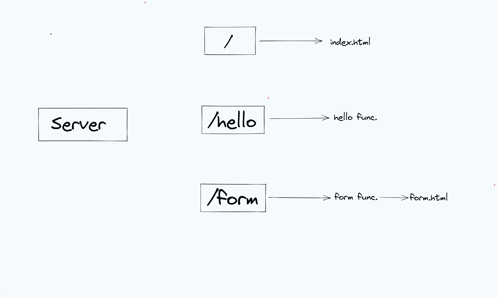

**Go-Server**
---

This is a a basic golang webserver that generates the response to the request made
by the user on several endpoints. 

**Project Structure**

There will be three endpoints that will be targeted by the server _/, /hello, /form_.

1. _/_ will generate the response via _index.html_ file.

2. _/hello_ endpoint will generate a simple "Hello!" message to the browser.

3. _/form_ will generate the Output to the form that is available at _/form.html_.

**Run locally**

Use the command `go run ./cmd/web/*.go
`. This will make sure all the go files are compiled successfully 
irrespective of where they are present.

**Additional Information:** 

Take this project as a basic step to understand how web development is integrated with
golang. While using this project, you're sure to find bugs and feel like adding some CSS, new features and so on. 
Feel free to raise a Pull Request for the same.